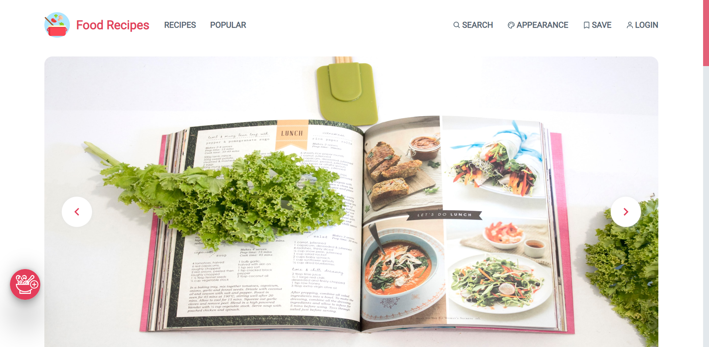

# Recommend Food Recipes App

## About

Build an integrated food recipe sharing website that recommends similar food based on content based algorithms.

**Link demo :** [https://food-recipes-ig8xebr3e-nguyentanpil.vercel.app/](https://food-recipes-ig8xebr3e-nguyentanpil.vercel.app/)



## Description

### documents folder

- presentation.pptx file
- report.docx file
- report.pdf file
- train.ipynb file

### Install node modules

```
  $ yarn install
  --- or ---
  $ npm install

```

### Run App

```
  $ npm start
  --- or ---
  $ yarn start
```

### Database and Authentication

- [Firebase](https://firebase.google.com/)

### Run

Open your browser to http://localhost:3000

## References

- Theme : https://preview.themeforest.net/item/ranna-food-recipe-wordpress-theme/full_screen_preview/25157340?_ga=2.123274763.1423882099.1645103842-137967102.1644394977
- Website : https://www.food.com/ideas/most-tweaked-recipes-6655#c-583997
